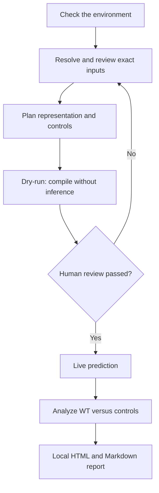

# PPI Scout

[](https://github.com/ZHULUYI-KyushuU/ppi-scout/actions/workflows/ci.yml)
[](https://www.python.org/)
[](LICENSE)

PPI Scout is a local-first command-line workflow for planning, running, and
reviewing Boltz protein-complex and motif-peptide screens. It keeps exact
inputs, representation choices, MSA policy, controls, logs, and reports
together so that a run can be audited and repeated.

> PPI Scout reports structural-model evidence. It does **not** prove that two
> proteins bind, and model confidence is not experimental evidence.

## Start here

| Your goal | Read or run this first |
|---|---|
| Understand the project in two minutes | [What it does](#what-it-does) and [How a run flows](#how-a-run-flows) |
| Install and complete a first dry run | [Five-minute dry run](#five-minute-dry-run) |
| Learn every supported command | [User Guide](docs/USER_GUIDE.md) |
| Reproduce the public examples | [Example Workflows](examples/README.md) |
| Use the portable hard-offline bundle | [Portable Bundle Guide](portable/README.md) |
| Understand the code and output files | [Architecture](docs/ARCHITECTURE.md) |
| Find a specific document | [Documentation Map](docs/README.md) |
| Change the code | [Contributing Guide](CONTRIBUTING.md) |

## What it does

PPI Scout can:

- validate names, accessions, literal sequences, and single-record FASTA files;
- route a question to full-length, domain, motif-peptide, or manual review;
- scan a resolved sequence for canonical AIM/LIR candidates;
- generate nested peptide windows and matched negative controls;
- compile Boltz inputs without silently changing the MSA policy;
- perform safe dry runs by default and require `--live` for inference;
- run and resume a complete reviewed motif/control panel;
- collect confidence fields and create Markdown and self-contained HTML reports;
- enforce a hard-offline entry point that blocks Python network sockets; and
- display interactive prompts in Chinese, English, or Japanese.

PPI Scout does not silently retrieve an ambiguous sequence, decide that a
sequence motif is biologically functional, or turn a prediction into a binding
claim.

## How a run flows



## Requirements

| Use case | Requirement |
|---|---|
| Planning, scanning, design, and visualization | Python 3.10–3.12 |
| Live prediction | PPI Scout and a compatible Boltz installation in the same environment |
| Practical local inference | A supported accelerator; NVIDIA CUDA or Apple Silicon MPS are the intended paths |
| Windows NVIDIA inference | WSL2 with Ubuntu is recommended |

CPU inference is possible upstream but is substantially slower than GPU
inference. See the [official Boltz repository](https://github.com/jwohlwend/boltz)
for current backend requirements.

## Installation

Install the versioned release directly from GitHub:

```bash
python -m pip install "git+https://github.com/ZHULUYI-KyushuU/ppi-scout.git@v0.5.0"
```

To use the examples, documentation, or repository-scoped Codex Skill, install
from a complete clone:

```bash
git clone https://github.com/ZHULUYI-KyushuU/ppi-scout.git
cd ppi-scout
python3 -m venv .venv
. .venv/bin/activate
python -m pip install --upgrade pip
python -m pip install .
```

PowerShell users can install without changing script-execution policy:

```powershell
py -3.12 -m venv .venv
.\.venv\Scripts\python.exe -m pip install --upgrade pip
.\.venv\Scripts\python.exe -m pip install .
.\.venv\Scripts\ppi-scout.exe --lang en doctor
```

Install Boltz in the same environment only when live prediction is needed:

```bash
# NVIDIA CUDA
python -m pip install --upgrade "boltz[cuda]"

# CPU or non-CUDA package
python -m pip install --upgrade boltz
```

Boltz downloads model data on first use. Its default cache is `~/.boltz`; set
`BOLTZ_CACHE` to an absolute path to place the cache elsewhere.

## Five-minute dry run

This bundled Atg8–Yta7 example creates a complete WT/control plan without
running Boltz or consuming GPU time:

```bash
ppi-scout --lang en doctor

ppi-scout run-panel examples/atg8-yta7-fdfl-job.json \
  --windows 24 \
  --design-seed 7 \
  --output-dir runs/atg8-yta7-fdfl \
  --dry-run

ppi-scout --lang en visualize runs/atg8-yta7-fdfl
```

The frozen public example uses Yta7 P40340 residues 43–66,
`KINYAEIEKVFDFLEDDQVMDKDE`. Its `FDFL` core is peptide positions 11–14 and
source-protein positions 53–56, using 1-based inclusive coordinates.

After reviewing exact sequences, coordinates, controls, MSA policy, output
location, and expected compute cost, replace `--dry-run` with `--live` to start
or resume inference. The default does not contact a remote MSA service.

## Command map

| Command | Purpose | Starts inference? |
|---|---|---:|
| `ppi-scout doctor` | Check Python, optional dependencies, Boltz, and accelerator visibility | No |
| `ppi-scout plan` | Resolve inputs and create a reviewed job JSON | No |
| `ppi-scout scan-motifs` | List canonical AIM/LIR sequence candidates and optionally design peptides | No |
| `ppi-scout run --dry-run` | Compile one reviewed job and its backend command | No |
| `ppi-scout run --live` | Execute one compiled Boltz job | Yes |
| `ppi-scout run-panel --dry-run` | Build the complete WT/control panel | No |
| `ppi-scout run-panel --live` | Run or resume every unfinished panel task | Yes |
| `ppi-scout resume` | Continue an interrupted run with matching inputs | Yes |
| `ppi-scout analyze` | Collect discovered confidence fields | No |
| `ppi-scout report` | Write a Markdown report | No |
| `ppi-scout visualize` | Create or regenerate a local self-contained HTML report | No |

Run `ppi-scout --help` or `ppi-scout COMMAND --help` for the exact options
available in the installed version.

## MSA and privacy policy

PPI Scout does not enable a remote MSA service by default.

- Use a precomputed local MSA when provenance and confidentiality must remain
  under local control.
- Use `msa: empty` for single-sequence inference and record the expected
  accuracy tradeoff.
- Add `--remote-msa` only after explicitly authorizing external sequence
  transmission.
- Never commit private sequences, credentials, model caches, or run outputs.

The hard-offline entry point is `python -m ppi_scout.offline`. It rejects
remote MSA, enables upstream offline flags, and blocks Python IPv4/IPv6 sockets
while preserving local inter-process communication. See the
[Portable Bundle Guide](portable/README.md).

## Interpretation boundary

- Do not interpret ipTM, protein ipTM, pLDDT, confidence score, or rank score
  as proof of interaction.
- Inspect the predicted interface and compare WT against matched controls
  generated under identical settings.
- Do not use the Boltz affinity module for protein–protein or protein–peptide
  affinity; its upstream scope is small-molecule ligands against protein
  targets.
- Confirm model-derived hypotheses with independent structural, biochemical,
  genetic, or cell-biological evidence.

## Repository layout

```text
ppi-scout/
├── .agents/skills/ppi-scout/   Optional Codex Skill instructions
├── .github/workflows/          Automated tests and offline release builders
├── docs/                       User, architecture, cloud, and release guides
├── examples/                   Frozen public FASTA, jobs, panels, and commands
├── locales/                    Chinese, English, and Japanese interface text
├── portable/                   Hard-offline bundle documentation
├── scripts/                    Release preparation and manifest validation
├── src/ppi_scout/              Installable Python package
├── tests/                      Unit, integration, and command smoke tests
├── CHANGELOG.md                User-facing version history
├── CONTRIBUTING.md             Development workflow
├── LICENSE                     MIT license text
└── pyproject.toml              Package metadata and dependency declarations
```

Generated run directories belong outside the source tree or under the ignored
`runs/` directory. They are scientific artifacts, not source code.

## Development

```bash
python -m pip install -e ".[test]"
python -m pytest
python -m compileall -q src scripts tests
```

Before a release, follow the [Release Checklist](docs/RELEASE_CHECKLIST.md) and
record user-facing changes in the [Changelog](CHANGELOG.md).

## License

PPI Scout is distributed under the [MIT License](LICENSE).
