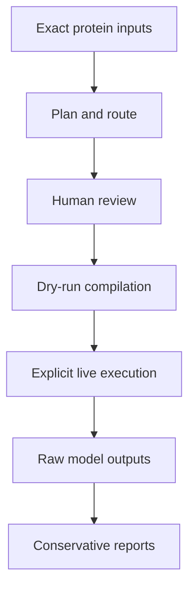

# Architecture

PPI Scout is a small standard-library-first orchestration layer around local
structure-prediction backends. It separates scientific planning, command
compilation, execution, and interpretation so that none of those stages can
silently rewrite another.

## Data flow

The review boundary is intentional. PPI Scout can prepare evidence and
controls, but it cannot decide that a predicted complex proves biological
binding.

## Source modules

| Module | Responsibility | Must not do |
|---|---|---|
| `resolver.py` | Normalize exact sequences and resolve reviewed UniProt inputs | Guess an ambiguous identity |
| `router.py` | Select full-length, domain, motif-peptide, or review-required representation | Route from length alone |
| `motif_scan.py` | Report every canonical AIM/LIR sequence match with transparent heuristics | Claim motif function or accessibility |
| `peptide_design.py` | Produce nested WT peptides and matched controls | Select a biological candidate silently |
| `panel_execution.py` | Freeze one reviewed hypothesis into matched Boltz tasks | Change MSA or backend settings between controls |
| `msa_library.py` | Resolve a local A3M only by exact receptor sequence hash | Guess a near-matching MSA |
| `backends/boltz2.py` | Compile and run local Boltz commands | Install dependencies or enable remote MSA automatically |
| `executor.py` | Write manifests, execute tasks, and resume identical runs | Reuse a run directory for changed inputs |
| `analysis.py` | Collect raw confidence fields | Convert confidence into proof of interaction |
| `reporting.py` | Write conservative Markdown interpretation | Hide missing or incomplete outputs |
| `visualization.py` | Generate a self-contained offline HTML view | Contact a server to display results |
| `offline.py` | Block Python IPv4/IPv6 access for portable runs | Permit `--remote-msa` |
| `cli.py` | Connect commands to the modules above | Contain hidden scientific defaults |

## Run artifacts

| Artifact | Meaning |
|---|---|
| `job.json` | Reviewed biological question and representation |
| `manifest.resolved.json` | Frozen executable panel with exact sequences and settings |
| `plan.json` | Every compiled backend task and command |
| `inputs/` | One auditable Boltz input per task |
| `predictions/` | Raw backend output directories |
| `logs/` | Command, return code, stdout, and stderr for each task |
| `status.json` | Current task state and resume information |
| `confidence_summary.csv` | Raw collected confidence fields |
| `report.md` | Conservative text report |
| `report.html` | Self-contained offline result view |

## Public interfaces

- `ppi-scout`: normal CLI entry point.
- `python -m ppi_scout.offline`: hard-offline entry point.
- `@ppi-scout` or `$ppi-scout`: optional repository-scoped Codex Skill.
- JSON jobs and manifests: stable, human-auditable workflow boundaries.

## Dependency boundary

Planning, routing, motif scanning, control design, and visualization use the
Python standard library. Heavy inference dependencies stay behind the Boltz
backend adapter. This keeps planning usable on computers that cannot run the
model and prevents environment setup from changing scientific decisions.
